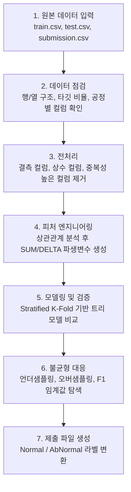

# LG Aimers 5기 온라인 해커톤 - 제조 품질 이상 탐지

제조 공정 데이터를 활용해 제품의 정상/이상 여부를 예측한 이진 분류 프로젝트입니다. 약 4만 건의 학습 데이터와 460개 이상의 공정 피처를 바탕으로 `Normal` / `AbNormal`을 분류하고, 클래스 불균형 상황에서 F1 성능을 개선하는 데 초점을 맞췄습니다.

## 1. 프로젝트 개요

- 기간: 2024.08
- 주제: 제조 공정 데이터 기반 제품 이상 여부 예측
- 문제 유형: 이진 분류
- 타깃: `Normal`, `AbNormal`
- 역할: 팀 프로젝트 내 데이터 전처리, 피처 엔지니어링, 모델 실험 및 제출 파이프라인 구축
- 목표: 고차원 제조 공정 데이터를 정제하고, 불균형 분류 상황에서 이상 제품을 효과적으로 탐지하는 모델 구현
- 결과물: 전처리 파이프라인, 상관관계 기반 피처 정리, 파생변수 생성, 트리 기반 모델 비교, 샘플링/임계값 조정 실험, 최종 제출 노트북

## 2. 문제 정의

초기 데이터는 공정별 검사값, 설비 정보, 작업 정보, 판정값이 넓은 테이블 형태로 구성되어 있었습니다. 단순히 모든 컬럼을 모델에 넣으면 결측치가 많거나 거의 동일한 정보를 담은 피처가 많아 모델이 불필요한 노이즈를 학습할 가능성이 컸습니다.

또한 타깃은 `Normal`이 대부분이고 `AbNormal`은 적은 불균형 구조였습니다. 따라서 단순 정확도보다 이상 클래스 탐지 성능을 높이는 방향이 중요했습니다.

이 프로젝트에서는 문제를 다음처럼 정리했습니다.

1. 공정 데이터에서 결측/상수/중복성 높은 컬럼을 제거한다.
2. 공정별 반복 피처와 강한 상관관계를 가진 피처 그룹을 분석한다.
3. 유사 피처를 `SUM`, `DELTA` 파생변수로 요약한다.
4. 불균형 데이터를 고려해 샘플링과 F1 기반 임계값을 조정한다.
5. 여러 트리 기반 모델을 비교해 최종 제출 결과를 생성한다.

## 3. 예측 파이프라인

이 프로젝트의 핵심은 "모델 하나를 학습하는 것"보다 제조 공정 데이터의 구조를 정리하고, 이상 탐지에 필요한 피처와 검증 방식을 만드는 것이었습니다.



## 4. 핵심 구현

### 데이터 전처리

- 전체 값이 결측인 컬럼 제거
- 단일 값만 가지는 컬럼 제거
- `OK` 등 판정값이 섞여 정보량이 낮거나 중복성이 큰 컬럼 정리
- 테스트 데이터의 `Set ID`와 제출용 `target` 컬럼을 분리해 학습 피처와 제출 포맷을 관리

### 상관관계 기반 피처 엔지니어링

공정 데이터에는 유사한 센서값이나 반복 측정값이 많았습니다. 대표 노트북에서는 상관계수 1.0 또는 0.99 이상인 피처 그룹을 탐색하고, 단순 삭제뿐 아니라 의미가 있는 경우 다음 방식으로 파생변수를 만들었습니다.

- `SUM`: 유사 공정 또는 반복 측정값을 합산해 전체 수준을 표현
- `DELTA`: 공정 간 차이나 위치 차이를 반영해 이상 패턴을 포착

### 모델링

트리 기반 모델을 중심으로 여러 후보를 비교했습니다.

- RandomForest
- XGBoost
- LightGBM
- CatBoost

검증은 클래스 비율을 유지하기 위해 Stratified K-Fold를 사용했고, 최종 예측에서는 F1 점수를 기준으로 임계값 조정을 실험했습니다.

### 불균형 대응

이상 클래스가 적은 문제였기 때문에 단순 학습만으로는 `AbNormal` 탐지가 약해질 수 있었습니다. 이를 보완하기 위해 다음 전략을 실험했습니다.

- Normal/AbNormal 비율을 조정하는 언더샘플링
- RandomOverSampler 기반 오버샘플링
- 후보 임계값별 F1 점수 비교

## 5. 데이터 처리 및 공개 범위

원본 데이터는 LG Aimers 온라인 해커톤에서 제공된 대회 데이터입니다. 데이터 공개 범위와 라이선스를 고려해 저장소에는 원본 `train.csv`, `test.csv`, `submission.csv` 및 제출용 CSV 파일을 포함하지 않았습니다.

노트북 실행 시에는 아래 구조로 원본 데이터를 별도 배치해야 합니다.

```text
data/
  train.csv
  test.csv
  submission.csv
```

대표 노트북에서 확인한 데이터 구조는 다음과 같습니다.

- 학습 데이터: 약 40,506행, 464개 컬럼
- 테스트 데이터: 약 17,361행, `Set ID`와 제출용 `target` 컬럼 포함
- 주요 피처: 공정별 설비 정보, 검사 결과, 좌표/속도/압력/생산량 관련 수치형 피처, 범주형 공정 정보

## 6. 주요 산출물

- 대표 노트북: [`notebooks/final_modeling.ipynb`](notebooks/final_modeling.ipynb)
- 실험 요약: [`docs/experiment_summary.md`](docs/experiment_summary.md)
- 재현 방법: [`docs/reproducibility.md`](docs/reproducibility.md)
- 발표 자료: [`assets/presentation_lg_aimers_5th_online_hackathon.pptx`](assets/presentation_lg_aimers_5th_online_hackathon.pptx)
- 수료 증빙: [`assets/lg_ai_certificate.pdf`](assets/lg_ai_certificate.pdf)

## 7. 저장소 구성

```text
.
├── README.md
├── requirements.txt
├── docs/
│   ├── experiment_summary.md
│   └── reproducibility.md
├── notebooks/
│   ├── final_modeling.ipynb
│   └── experiments/
│       ├── latest_score_experiment.ipynb
│       ├── feature_importance_experiment.ipynb
│       └── process_analysis_experiment.ipynb
└── assets/
    ├── decision_tree_high_res.png
    ├── model_output.png
    ├── presentation_lg_aimers_5th_online_hackathon.pptx
    └── lg_ai_certificate.pdf
```

## 8. 한계와 배운 점

가장 큰 한계는 대회 데이터 특성상 최종 평가 기준과 테스트 라벨을 직접 확인할 수 없다는 점이었습니다. 따라서 로컬 검증 점수와 실제 제출 성능 사이에 차이가 날 수 있고, 검증 설계를 얼마나 안정적으로 가져가는지가 중요했습니다.

또한 제조 공정 데이터에서는 컬럼 수가 많다는 사실 자체보다 "비슷한 의미를 가진 피처가 반복적으로 존재한다"는 점이 더 큰 문제였습니다. 이 경험을 통해 모델 성능 개선은 알고리즘 선택만으로 해결되지 않으며, 도메인 구조를 반영한 피처 정리와 검증 기준 설계가 함께 필요하다는 점을 배웠습니다.

## 9. 실행 환경

노트북은 프로젝트 수행 당시의 실험 흐름을 보존한 자료입니다. 원본 데이터와 제출 파일은 공개 저장소에서 제외되어 있으므로, 전체 재실행을 위해서는 대회 제공 데이터를 별도로 준비해야 합니다.

주요 라이브러리는 다음과 같습니다.

- Python
- pandas, numpy
- scikit-learn
- imbalanced-learn
- xgboost, lightgbm, catboost
- matplotlib, seaborn
- optuna, shap

설치 예시는 다음과 같습니다.

```bash
pip install -r requirements.txt
```
