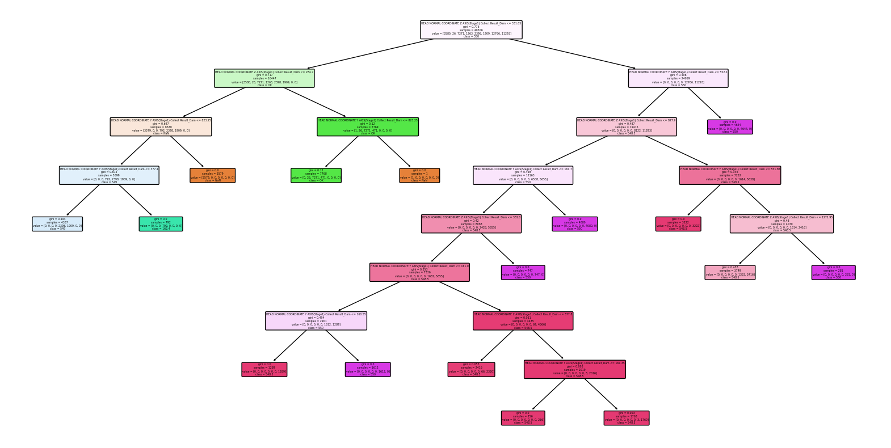
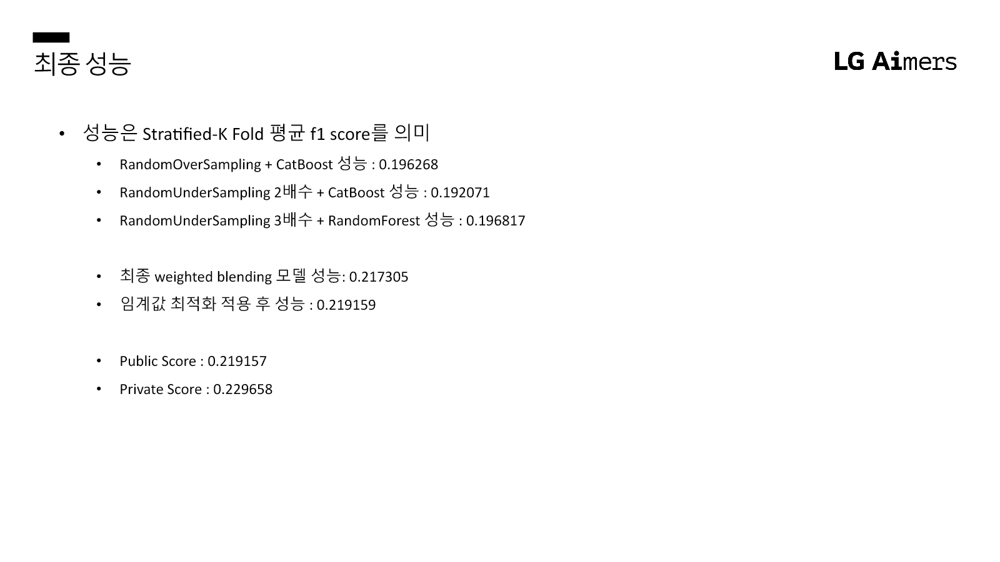

<p align="center">
  
</p>

# LG AImers 5기 | 제조 품질 이상 탐지

<p align="center">고차원 제조 공정 데이터에서 <code>AbNormal</code>을 놓치지 않기 위한 불균형 분류 실험</p>

<p align="center">
  
  
  
  
</p>

## 프로젝트 한눈에 보기

| 구분 | 내용 |
| --- | --- |
| 프로젝트 | LG Aimers 5기 온라인 해커톤 (2024.08.01–08.30) |
| 대회 | [LG Aimers 5기 온라인 해커톤](https://lgaimers5th.elice.io/explore) |
| 문제 | 제조 공정·장비·검사 feature로 `Normal` / `AbNormal` 분류 |
| 데이터 | Train 40,506행 · 464열 / Test 17,361행 |
| 난점 | 소수 `AbNormal` class, 결측·상수·중복·`OK` 혼입 변수 |
| 검증 기준 | fold별 train 데이터에서 전처리 규칙을 학습하는 5-fold Stratified CV의 F1 score |
| 결과 | Private score **0.229658** |

## 왜 이 문제를 풀었나

정확도만 높아도 드문 이상 상태를 놓치면 품질 관리에는 도움이 되지 않습니다. 그래서 노이즈성 공정 변수를 정리하고, 소수 class 비율을 보존한 검증과 샘플링 전략으로 `AbNormal` 탐지 성능을 비교했습니다.

## 접근과 판단

| 단계 | 구현 | 판단 기준 |
| --- | --- | --- |
| 데이터 정리 | 식별자·완전 결측·상수·중복·오염 컬럼 제거 | 학습에 기여하지 않는 공정 변수를 먼저 축소 |
| feature engineering | 상관관계 공정 그룹의 `SUM`·`DELTA` 파생 변수 | 반복 공정 값의 관계를 보존 |
| 검증 | 5-fold Stratified CV | 각 fold의 class 비율을 유지해 F1 비교 |
| 불균형 대응 | Random over/under sampling | 소수 class 재현율과 F1의 trade-off 확인 |
| 최종 예측 | CatBoost·RandomForest 가중 블렌딩, threshold 탐색 | 단일 모델보다 안정적인 F1 확보 |

Notion 실험 기록 기준으로 `Set ID`와 완전 결측 278개, 상수 35개, 중복 26개 컬럼을 우선 제거했습니다. 이후 0.99 이상 상관관계 쌍 91개를 단순 제거와 파생 변수화 두 방식으로 비교해, 공정값 관계가 남도록 `SUM`·`DELTA`를 적용했습니다. 공개 노트북은 CV의 각 fold에서 train 부분으로만 이 규칙을 정하고 validation에 적용합니다.


```mermaid
flowchart LR
    A["공식 대회 CSV"] --> B["공정 변수 정리"]
    B --> C["SUM · DELTA feature"]
    C --> D["Stratified 5-fold"]
    D --> E["Sampling + Tree models"]
    E --> F["Weighted blending"]
    F --> G["Threshold 최적화 · 제출"]
```

## 결과

발표자료의 실험 결과입니다. 모든 검증 값은 Stratified 5-fold 평균 F1입니다.

| 모델 / 설정 | F1 |
| --- | ---: |
| RandomOverSampling + CatBoost | 0.196268 |
| RandomUnderSampling 2배수 + CatBoost | 0.192071 |
| RandomUnderSampling 3배수 + RandomForest | 0.196817 |
| 가중 블렌딩 | 0.217305 |
| 임계값 최적화 후 | **0.219159** |

| 대회 점수 | Score |
| --- | ---: |
| Public | 0.219157 |
| Private | **0.229658** |

<p align="center">
  
</p>

<p align="center"><sub>실제 발표자료의 최종 성능 슬라이드</sub></p>

제출 기록상 초기 sample submission의 Public F1 0.149239에서, 상관관계 처리·블렌딩·후처리 실험을 거쳐 최종 Public 0.219157까지 개선했습니다. 공개 레퍼런스 노트북은 이 과정에서 선택한 `ROS CatBoost (0.5)`, `under-2 CatBoost (0.3)`, `under-3 RandomForest (0.2)`의 확률 가중 블렌딩과 CV 기반 threshold 탐색을 재현합니다. 대회 제출본의 개별 후처리까지는 포함하지 않습니다.

## 내 기여

- 완전 결측 278개·상수 35개·중복 26개를 포함한 노이즈성 공정 컬럼을 선별해 제거했습니다.
- 상관관계가 높은 반복 공정 변수에서 `SUM`, `DELTA` 파생 변수를 설계했습니다.
- 5-fold Stratified CV에서 sampling 비율과 tree 기반 모델을 비교하고, 가중 블렌딩과 threshold를 결정했습니다.
- 제출 기록을 관리하며 Public F1 0.149239 → 0.219157 개선 과정을 검증했습니다.

## 팀

Notion 제출·실험 기록에서 확인한 팀원의 담당 실험입니다.

| 구성원 | 담당 |
| --- | --- |
| 박민규 | 데이터 정리, 상관관계 기반 `SUM`·`DELTA` 설계, 범주형 인코딩, Stratified CV·블렌딩·제출 파이프라인 |
| 승원 | 언더샘플링·CatBoost·파생 변수 및 블렌딩 실험 |
| 준형 | `OK` 혼입/결측 변수 처리와 KNN·최빈값 대체 실험 |
| 은재 | F1 임계값 최적화 실험 |

## 실제 구현물

| 자료 | 내용 |
| --- | --- |
| [최종 모델링 노트북](notebooks/final_modeling.ipynb) | 원본 실험의 핵심 전처리·샘플링·블렌딩을 재구성한 레퍼런스 |
| [발표 자료](assets/presentation_lg_aimers_5th_online_hackathon.pptx) | 전처리·모델·검증 결과 원본 |
| [실제 모델 출력](assets/model_output.png) | Decision Tree 시각화 원본 |
| [최종 성능 슬라이드](assets/final_performance_slide.png) | 발표자료에서 추출한 실제 성능 결과 |

## 실행

```bash
pip install -r requirements.txt
jupyter notebook notebooks/final_modeling.ipynb
```

노트북 kernel metadata는 Python 3.11이며, `requirements.txt`는 고정 버전으로 제공합니다. 공식 대회 CSV는 포함하지 않습니다. `data/train.csv`, `data/test.csv`, `data/submission.csv`를 준비하면 노트북의 공개 파이프라인을 실행할 수 있습니다. 원본 데이터·개별 제출 후처리·당시 실행 환경은 공개하지 않아, 당시 리더보드 점수와 완전히 같은 결과를 보장하지는 않습니다.

## 이용 안내

이 저장소는 포트폴리오·학습 기록 열람을 위해 공개합니다. 코드·문서·이미지의 재사용, 수정, 배포는 사전 문의가 필요합니다.
