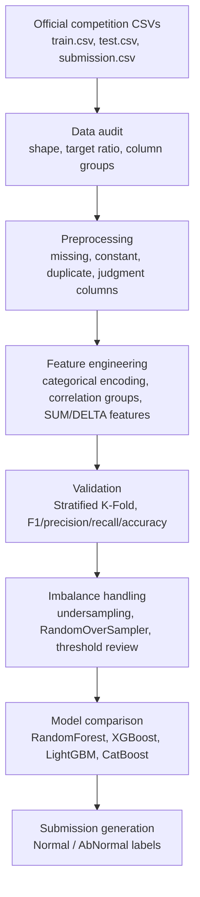

# LG AImers 5th Manufacturing Quality Prediction

Machine-learning competition portfolio repo for predicting `Normal` vs `AbNormal` manufacturing quality from high-dimensional process data.

## Overview

This project was built for the LG AImers 5th online hackathon. The practical problem is early detection of abnormal manufacturing outcomes from process, equipment, inspection, and work-order signals. The repository focuses on the modeling work that can be inspected publicly: data cleaning logic, feature engineering experiments, validation design, imbalance handling, tree-model comparison, and submission-file generation.

The original competition data is not included. Reviewers can inspect the notebooks and docs, then reproduce the pipeline only after placing the official competition CSV files in the expected local `data/` directory.

## Role

My contribution in this public repo centers on the ML pipeline:

- Cleaned high-dimensional manufacturing tables by removing fully missing columns, constant columns, duplicate/noisy judgment columns, and fields that were not useful for training.
- Built process-aware feature engineering experiments, including correlation-group reduction and derived `SUM` / `DELTA` features for repeated or near-duplicate process measurements.
- Compared tree-based models under a stratified validation setup.
- Tested imbalance strategies for the minority `AbNormal` class, including undersampling, `RandomOverSampler`, and F1-oriented threshold review.
- Organized the final notebook, experiment notes, reproducibility guidance, and public-safe data policy for portfolio inspection.

## Problem

The target is binary classification:

- `Normal`: product/process instance treated as normal.
- `AbNormal`: product/process instance treated as abnormal.

The challenge is not only model selection. The input table has more than 460 process features and roughly 40,000 training rows, with many missing, constant, duplicated, categorical, or strongly correlated columns. The `AbNormal` class is much smaller than the `Normal` class, so accuracy alone is not useful. The project therefore treats minority-class detection and F1 behavior as the central modeling concern.

## Metric

The working metric in this repo is F1 for the abnormal-class detection task. The notebooks also record precision, recall, and accuracy during validation so the tradeoff is visible:

- Higher recall can catch more abnormal cases but may create more false positives.
- Higher precision can reduce false alarms but may miss abnormal cases.
- F1 gives one operating-point summary for comparing sampling and model choices.

No public leaderboard rank or final private score is claimed in this README because the repo does not contain a safely publishable, independently verifiable leaderboard artifact.

## Approach


```mermaid
flowchart TB
    A["Official competition CSVs<br/>train.csv, test.csv, submission.csv"]
    B["Data audit<br/>shape, target ratio, column groups"]
    C["Preprocessing<br/>missing, constant, duplicate, judgment columns"]
    D["Feature engineering<br/>categorical encoding, correlation groups, SUM/DELTA features"]
    E["Validation<br/>Stratified K-Fold, F1/precision/recall/accuracy"]
    F["Imbalance handling<br/>undersampling, RandomOverSampler, threshold review"]
    G["Model comparison<br/>RandomForest, XGBoost, LightGBM, CatBoost"]
    H["Submission generation<br/>Normal / AbNormal labels"]

    A --> B --> C --> D --> E --> F --> G --> H
```

## Technical Decisions

### Data cleaning

- Removed columns that are entirely missing.
- Removed columns with a single observed value.
- Removed noisy or redundant judgment columns where the value pattern did not add predictive signal.
- Kept `Set ID` and target/submission handling separate from training features.
- Encoded categorical process fields before model training.

### Feature engineering

Manufacturing datasets often contain repeated measurements, paired equipment readings, and near-duplicate process fields. The experiment notebooks inspect high-correlation feature groups and derive compact signals:

- `SUM`: combines related repeated measurements to represent total process intensity.
- `DELTA`: captures difference patterns that may expose abnormal variation between similar process readings.

This keeps the feature work tied to the process structure instead of only passing a wide raw table into a model.

### Validation

The notebook uses `StratifiedKFold` so each fold keeps a similar `Normal` / `AbNormal` ratio. This matters because the abnormal class is sparse, and random folds can otherwise produce unstable minority-class estimates.

Validation reports include F1, precision, recall, and accuracy. The README intentionally treats those as local experiment evidence, not as a final competition score guarantee.

### Imbalance Handling

The repo documents three imbalance strategies:

- Baseline training on the cleaned feature table.
- Undersampling normal-class rows at several ratios.
- `RandomOverSampler` for the minority class.

The comparison focuses on F1 and the precision/recall tradeoff instead of optimizing for accuracy.

### Final Model Approach

The main candidate family is tree-based classification:

- RandomForest
- XGBoost
- LightGBM
- CatBoost

The final notebook emphasizes CatBoost and related tree models because they are strong tabular baselines for mixed numeric/categorical manufacturing features and are practical for rapid competition iteration. The final public artifact is the modeling pipeline and experiment history, not a claim that one model universally dominates outside the competition setting.

## Evidence and Results

Inspectable evidence in this repo:

- Main pipeline: [`notebooks/final_modeling.ipynb`](notebooks/final_modeling.ipynb)
- Experiment summary: [`docs/experiment_summary.md`](docs/experiment_summary.md)
- Reproduction boundary: [`docs/reproducibility.md`](docs/reproducibility.md)
- Supporting experiment notebooks:
  - [`notebooks/experiments/latest_score_experiment.ipynb`](notebooks/experiments/latest_score_experiment.ipynb)
  - [`notebooks/experiments/feature_importance_experiment.ipynb`](notebooks/experiments/feature_importance_experiment.ipynb)
  - [`notebooks/experiments/process_analysis_experiment.ipynb`](notebooks/experiments/process_analysis_experiment.ipynb)
- Presentation artifact: [`assets/presentation_lg_aimers_5th_online_hackathon.pptx`](assets/presentation_lg_aimers_5th_online_hackathon.pptx)

The notebook output includes local validation tables for sampling/model experiments. Because the raw competition data and final submitted CSVs are excluded, this public repo should be reviewed as an inspection-first portfolio artifact unless the reviewer has legitimate access to the competition files.

## Data and Public Safety

The official LG AImers competition data is excluded from this repository.

Expected local layout for authorized reproduction:

```text
data/
  train.csv
  test.csv
  submission.csv
```

Excluded from public publication:

- Raw `train.csv`, `test.csv`, and `submission.csv`.
- Generated submission CSV files.
- Any Drive-only final materials that include private, teammate, certificate, or redistribution-sensitive information.
- Certificate files unless the user explicitly decides they are safe to publish.

The existing `assets/lg_ai_certificate.pdf` is treated as a publication-review blocker, not as evidence that should be highlighted for public reviewers.

## Reproduce

Install dependencies:

```bash
pip install -r requirements.txt
```

Run path for authorized users:

1. Place official competition CSVs under `data/`.
2. Open [`notebooks/final_modeling.ipynb`](notebooks/final_modeling.ipynb).
3. Run preprocessing cells before model training cells.
4. Review validation outputs for F1, precision, recall, and accuracy.
5. Generate a submission file only in a local ignored path.

Without the competition data, reviewers can still inspect the code, feature logic, validation design, experiment notebooks, and public-safe docs.

## Repository Structure

```text
.
|-- README.md
|-- requirements.txt
|-- docs/
|   |-- experiment_summary.md
|   `-- reproducibility.md
|-- notebooks/
|   |-- final_modeling.ipynb
|   `-- experiments/
|       |-- latest_score_experiment.ipynb
|       |-- feature_importance_experiment.ipynb
|       `-- process_analysis_experiment.ipynb
`-- assets/
    |-- decision_tree_high_res.png
    |-- model_output.png
    |-- presentation_lg_aimers_5th_online_hackathon.pptx
    `-- lg_ai_certificate.pdf
```

## Tech Stack

- Python
- pandas, numpy
- scikit-learn
- imbalanced-learn
- XGBoost, LightGBM, CatBoost
- matplotlib, seaborn
- optuna, shap
- Jupyter

## Limitations

- Full reproduction is blocked for public reviewers because the raw competition data is not redistributed.
- Local validation F1 can differ from competition scoring because fold design, sampling randomness, library versions, and hidden test distribution all matter.
- The public repo does not claim a verified leaderboard rank or final score.
- Notebook outputs may contain Colab-rendered JavaScript bundles; these should be treated as notebook-rendering artifacts unless a credential scan proves otherwise.
- The certificate PDF should be reviewed before public publication because certificates can contain personal identifiers.
- The modeling approach is competition-oriented and should not be treated as a deployed manufacturing-quality monitoring system without fresh data validation, drift checks, monitoring, and domain review.
